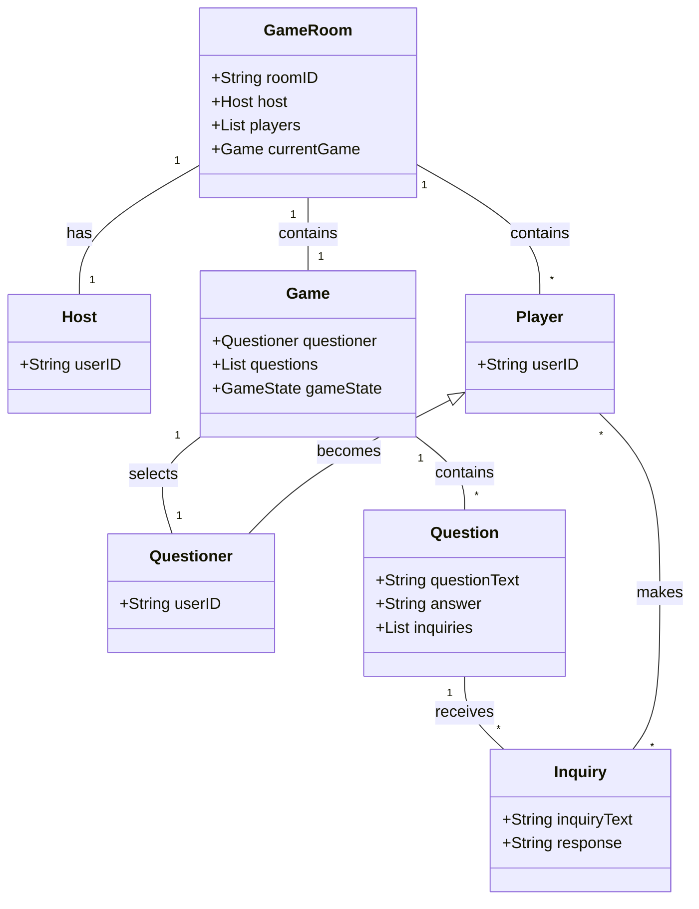

```mermaid
classDiagram
    GameRoom "1" -- "1" Host : has
    GameRoom "1" -- "1" Game : contains
    GameRoom "1" -- "*" Player : contains
    Game "1" -- "1" Questioner : selects
    Game "1" -- "*" Question : contains
    Question "1" -- "*" Inquiry : receives
    Player <|-- Questioner : becomes
    Player "*" -- "*" Inquiry : makes

    class GameRoom{
      +String roomID
      +Host host
      +List players
      +Game currentGame
    }
    class Host{
      +String userID
    }
    class Player{
      +String userID
    }
    class Game{
      +Questioner questioner
      +List questions
      +GameState gameState
    }
    class Questioner{
      +String userID
    }
    class Question{
      +String questionText
      +String answer
      +List inquiries
    }
    class Inquiry{
      +String inquiryText
      +String response
    }

```